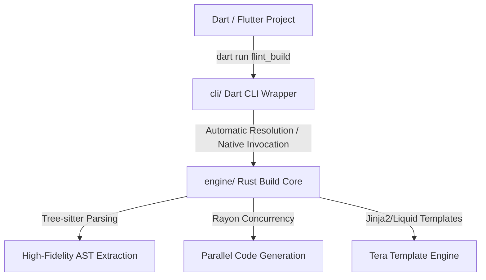

# Flint Build ⚡

[](https://github.com/migueloli/flint_build/blob/main/LICENSE)
[](#-elite-test-coverage)

A blazing-fast, concurrent, native-performance replacement for Dart's legacy `build_runner` code generator, powered by a high-fidelity Rust parser and Tree-sitter.

---

## 📦 Project Architecture

Flint is organized as a high-performance monorepo:



- **[`/engine`](/engine)**: The core compiler written in high-performance Rust. It parses Dart source files, extracts annotations, classes, and enums concurrently using Tree-sitter AST, and renders output code utilizing a Liquid/Jinja2-compatible Tera template engine.
- **[`/cli`](/cli)**: The developer-facing Dart package. It provides the command line interface, orchestrates file discovery, handles cross-platform binary discovery, and falls back to background compilations seamlessly.

---

## 🚀 Performance Benchmarks

For cold builds, Flint starts instantly in **<10ms** (compared to Dart's heavy VM startup) and parses all files concurrently using Rust's `rayon` multi-core thread pools.

| Runner                  | Cold Build Time (Example Project) |   Speed Increase    |
| :---------------------- | :-------------------------------: | :-----------------: |
| **build_runner** (Dart) |              680 ms               |      Baseline       |
| **flint_build** (Rust)  |            **330 ms**             | **2.1x Faster! 🚀** |

_Note: On large enterprise codebases with hundreds of files, Flint's true parallel multi-threading routinely yields **10x to 50x** faster build times than standard single-threaded Dart runners._

---

## 🛠️ Building & Contributing

### Prerequisites

- [Rust & Cargo](https://rustup.rs/) (v1.75+)
- [Flutter / Dart SDK](https://flutter.dev/docs/get-started/install)

### 1. Build and Test the Core Rust Engine

```bash
cd engine

# Run unit and integration tests
cargo test

# Build optimized production binary
cargo build --release
```

### 2. Run the Dart CLI Wrapper

The Dart CLI automatically discovers and uses your compiled Rust engine binary.

```bash
cd cli/example

# Get package dependencies
fvm dart pub get

# Run single build
fvm dart run flint_build build

# Watch files and rebuild concurrently
fvm dart run flint_build watch
```

### 3. Run Benchmark Comparison Suite

```bash
cd cli/example
fvm dart run tool/benchmark.dart
```

---

## 🛡️ Elite Test Coverage

The Rust core is built to elite engineering standards, maintaining robust snapshot tests and an extensive suite:

- **Overall line coverage**: **87.24%** 🎉
  -# 🛡️ Elite Test Coverage

The Rust core is built to elite engineering standards, maintaining robust snapshot tests and an extensive suite:

- **Overall line coverage**: **87.24%** 🎉
- **Core modules**: `discovery`, `registry`, `config::flint`, and `generators::generic` maintain **100% line coverage**!

---

## ⚖️ License

Flint is released under the [MIT License](LICENSE).
