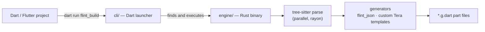

# Flint Build ⚡

A native, parallel code generator for Dart and Flutter that works like `build_runner` + `json_serializable`.
The engine is written in Rust and parses Dart with [tree-sitter](https://tree-sitter.github.io/).

> **Status: experimental (engine 0.1.0).** Flint generates correct `json_serializable`-style code for the
> common cases below, but it has known gaps that can produce code that doesn't compile. `clean` can also
> delete other generators' `*.g.dart` files. Read [Known limitations](#known-limitations) before trying it on
> a real project.

---

## Why

`build_runner` starts the Dart VM, resolves the whole program with the analyzer, and then runs generators.
On large apps that takes seconds to minutes. Flint does only what code generation needs: it parses each file's
**syntax** in parallel and renders templates. On the example project the engine finishes in about **13 ms**.

## Repository layout


```mermaid
flowchart LR
    A["Dart / Flutter project"] -->|dart run flint_build| B["cli/ — Dart launcher"]
    B -->|finds and executes| C["engine/ — Rust binary"]
    C --> D["tree-sitter parse<br/>(parallel, rayon)"]
    D --> E["generators<br/>flint_json · custom Tera templates"]
    E --> F["*.g.dart part files"]
```

| Path | What it is |
| ---- | ---------- |
| [`engine/`](engine) | Rust crate `flint_build`: discovery, parsing, generators, watcher. [README](engine/README.md) |
| [`cli/`](cli) | Dart package `flint_build`: the `dart run flint_build` entry point that finds and runs the engine. [README](cli/README.md) |
| [`cli/example/`](cli/example) | Sample app and benchmark comparing Flint with build_runner |
| [`docs/`](docs) | Design, roadmap, review and reference docs (below) |

## Quick start (from this repository)

You need Rust **1.88+** (`rustup`) and a Dart or Flutter SDK. The repo uses [FVM](https://fvm.app/); drop
the `fvm` prefix if you don't.

```bash
git clone https://github.com/migueloli/flint_build.git
cd flint_build/engine && cargo build --release   # the CLI would also build this on first run

cd ../cli/example
fvm dart pub get
fvm dart run flint_build build     # generate lib/**.g.dart
fvm dart run flint_build watch     # rebuild on change
```

In your own project, add Flint as a path dev-dependency and create a `flint.yaml`. See the
[CLI README](cli/README.md). Flint isn't on pub.dev yet, because the CLI can only find the engine inside
this repository (see the [roadmap](docs/ROADMAP.md#phase-4-installable-by-anyone)).

## What it supports

`@JsonSerializable` classes with `String`/`int`/`double`/`bool`/`DateTime`, `List`, `Map<String, V>`,
nested models, generic classes, same-file `@JsonEnum` enums, custom converters, and the common `@JsonKey`
options (`name`, `defaultValue`, `ignore`, `includeIfNull`, `fromJson`/`toJson`, …). You can also write your
own generator as a [Tera](https://keats.github.io/tera/) template, with no Rust required.

The full support matrix and the `flint.yaml` reference are in [docs/configuration.md](docs/configuration.md).

## Known limitations

These are the most important ones. All of them are tracked in [docs/REVIEW.md](docs/REVIEW.md) and scheduled
in the [roadmap](docs/ROADMAP.md).

- `clean` deletes **every** `*.g.dart` under `lib/`, including build_runner output from other generators (R1).
- Every file with any class gets a `.g.dart`, even without annotations (R2).
- Classes with more than one annotation, such as `@immutable @JsonSerializable()`, are skipped (R3).
- Enums declared in another file, and types like `num`, `Uri` or `Set`, generate code that doesn't compile (R7).
- Constructors are assumed to take every field as a named parameter (R8).

## Performance

| Measurement (example project, 1 model file) | Time |
| ------------------------------------------- | ---: |
| `build_runner build` via `fvm dart run` | 680 ms |
| `flint_build build` via `fvm dart run` (Dart launcher + engine) | 330 ms |
| Flint engine binary alone | ~13 ms |

Most of the 330 ms is Dart VM startup for the launcher, not code generation. The first two rows come from
[`cli/example/benchmark_results.txt`](cli/example/benchmark_results.txt), a single run. The last row is the
engine's own timer on a release build. We haven't yet measured projects with hundreds of files. A proper
benchmark suite is on the [roadmap](docs/ROADMAP.md#phase-3-incremental-and-fast-at-scale).

## Documentation

| Doc | For |
| --- | --- |
| [docs/configuration.md](docs/configuration.md) | Users: commands, `flint.yaml`, support matrix, template context |
| [docs/SDD.md](docs/SDD.md) | Contributors: architecture, data model, design decisions, target design |
| [docs/ROADMAP.md](docs/ROADMAP.md) | Everyone: phased plan and ideas |
| [docs/REVIEW.md](docs/REVIEW.md) | Contributors: findings from the latest project review, with IDs |
| [docs/specs/](docs/specs/README.md) | Contributors: spec-driven workflow for larger changes |
| [AGENTS.md](AGENTS.md) / [CLAUDE.md](CLAUDE.md) | AI coding agents: commands, rules, sharp edges |

## Contributing

```bash
cd engine
cargo fmt && cargo clippy --all-targets && cargo test
```

Changes to generated output, `flint.yaml`, CLI flags or the template context start with a spec. See the
[spec workflow](docs/specs/README.md). Snapshot changes are reviewed with `cargo insta review`.

## License

MIT, as declared in `engine/Cargo.toml`. A `LICENSE` file still needs to be added (roadmap Phase 0).
