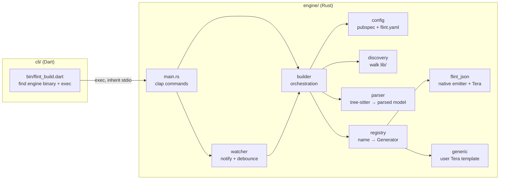

# Flint Build — Software Design Document

| | |
| --- | --- |
| **Status** | Living document. Update it in the same change as any design change. |
| **Scope** | The `engine/` Rust crate, the `cli/` Dart package, and the contract between them. |
| **Related** | [REVIEW.md](REVIEW.md) (current findings) · [ROADMAP.md](ROADMAP.md) (plan) · [configuration.md](configuration.md) (user-facing reference) · [specs/](specs/) (per-feature specs) |

Sections are marked **Current** (what the code does today) or **Target** (what we are building towards). When
you implement a Target item, move its text to Current and link the spec.

---

## 1. Purpose

Flint is a code generator for Dart/Flutter projects. It reads annotated Dart source, such as
`@JsonSerializable()` classes, and writes companion `.g.dart` part files, doing the same job as
`build_runner` + `json_serializable`. The heavy work runs in a native Rust binary. That avoids the Dart VM
startup and whole-program analysis that make `build_runner` slow.

## 2. Goals and non-goals

**Goals**

1. **Drop-in output:** for supported features, the generated code behaves like json_serializable's output. It
   compiles and produces the same JSON.
2. **Speed that grows with the project:** build time grows with the number of *changed* files, and all cores
   are used.
3. **Never damages user code:** Flint only writes and deletes files it can prove it owns (see §9).
4. **Extensible without Rust:** users can add a generator with a Tera template and a `flint.yaml` entry.
5. **Predictable:** the same inputs always produce byte-identical outputs, whatever the thread scheduling or
   plugin order.

**Non-goals (for now)**

- Replacing `build_runner` for generators that need full type resolution across packages, such as `freezed`
  unions or `riverpod_generator`. See §4 for why.
- Running Dart code at build time.
- Being a general Dart analyzer or language server.

## 3. Context

```text
Dart/Flutter project
 ├── pubspec.yaml         ← package name (read)
 ├── flint.yaml           ← plugin configuration (read, optional for json_serializable projects)
 ├── build.yaml           ← json_serializable options (read, optional; spec 0002)
 └── lib/**.dart          ← annotated sources (read)
        └── *.g.dart      ← generated parts (written/deleted by Flint)

dart run flint_build <cmd>   →   cli/bin/flint_build.dart   →   engine binary (flint_build)
```

## 4. The key constraint: parsing syntax only

Flint parses with **tree-sitter-dart**, which gives it a *syntax tree* and nothing more. It doesn't resolve
imports, types, or constants. That's where the speed comes from, and also where most of the limits come from:

| Knowable from one file's syntax | Not knowable without resolution |
| ------------------------------- | ------------------------------- |
| Class and enum names, fields, annotations, constructors, type text | Whether `Status` (imported) is an enum, a class, or a typedef |
| Literal annotation arguments (`name: 'id'`) | Values of `const` references (`name: kIdKey`) |
| Type parameters | Types from other packages, type aliases, extension types |

**How we deal with it (Target):** we resolve **within the project** without doing full type analysis:

1. **Index pass:** parse every file in the build roots in parallel and record every top-level declaration
   (`name → {kind: class|enum|mixin|typedef|extension type, file, annotations, constructors}`). This is cheap:
   tree-sitter is already doing the parse.
2. **Generate pass:** generators look type names up in the index. A name that isn't in the index and isn't a
   known `dart:core` type is an *unresolved type*. It becomes a clear diagnostic (with a hint such as
   `@JsonKey(fromJson:)` or a `converters:` entry) instead of silently generated `X.fromJson`.
3. **Escape hatches:** `flint.yaml` can list external types, e.g.
   `external_types: { Money: { kind: class, from_json: true } }`, so types from other packages don't need
   resolution.

This keeps Flint syntax-only, with no Dart SDK needed at build time, while fixing review items R7 and R8.

## 5. Architecture



### 5.1 Components (Current)

| Module | Responsibility | Notes |
| ------ | -------------- | ----- |
| `cli/bin/flint_build.dart` | Finds `engine/target/{release,debug}/flint_build`; runs `cargo build --release` if it's missing; runs the engine with the same arguments. | Only works inside this monorepo (D1). |
| `main.rs` | clap CLI: `build`, `watch`, `clean`. Registers built-in generators. | |
| `builder.rs` | For each plugin: discover → parse (in parallel) → generate → write `<name>.g.dart`. mtime-based skip. | Owns most of R2, R4, R11. |
| `config/` | `Pubspec` (`name`, dependency lookup). `FlintConfig` / `PluginConfig` with a hand-written `Deserialize` that turns missing lists into empty ones, plus `flint_json` defaults. `build_yaml` reads json_serializable options. `resolve` merges `flint.yaml` > `build.yaml` > defaults and reports notes and warnings. | Pure `resolve` function; only `load_project_config` touches the disk. |
| `discovery/` | `walkdir` over `lib/`; splits sources and `*.g.dart` outputs by file name. | Suffix-only ownership (R1). |
| `parser/` | tree-sitter queries → `ParsedFile { classes, enums }`. Reports syntax errors with a caret. | Keeps every class, not only annotated ones (A3). One annotation per class (R3). |
| `registry.rs` | `HashMap<String, Box<dyn Generator>>`. | |
| `generators/flint_json` | Works out the `fromJson`/`toJson` expression for each field, then renders the built-in `flint_json.tera`. | |
| `generators/generic.rs` | Filters by annotation, then renders the user's `template_path`. | |
| `watcher/` | `notify` + 500 ms debounce on `lib/`, then a full rebuild. | Reacts to its own output (R5). |

### 5.2 The `Generator` trait

```rust
// Current
pub trait Generator: Send + Sync {
    fn generate(&self, filename: &str, parsed_file: ParsedFile, plugin: &PluginConfig) -> String;
}
```

```rust
// Target
pub trait Generator: Send + Sync {
    /// Stable id, used in output headers and the cache fingerprint.
    fn id(&self) -> &str;
    /// Built once per build, before any file is processed (compiled templates, etc.).
    fn prepare(&mut self, plugin: &PluginConfig, index: &SymbolIndex) -> Result<(), FlintError>;
    /// Pure: same inputs → same output. `None` = nothing to emit for this file.
    fn generate(&self, unit: &SourceUnit, index: &SymbolIndex) -> Result<Option<Section>, Diagnostic>;
}
```

The Target version adds error reporting (R12), one-time setup (A1), and access to the symbol index (R7). It
returns a **section** rather than a whole file, so several plugins can share one `.g.dart` (R4, §9).

## 6. Data model

### 6.1 Current parsed model (`parser::dart_types`)

```text
ParsedFile { classes: [DartClass], enums: [DartEnum] }
DartClass  { name, type_parameters: [String], metadata: {String: String}, fields: [DartField] }
DartField  { name, dart_type: DartType, is_final, metadata: {String: String},
             converter?, from_json_expr?, to_json_expr? }   // last three are emitter scratch state
DartType   { kind: String|Int|Double|Bool|DateTime|List(T)|Map(K,V)|Custom(name), is_nullable }
DartEnum   { name, annotations: [String], values: [{ name, value? }] }
```

`metadata` flattens every annotation on a node into one map. Annotation names become keys with a value of
`""`; named arguments become `key → raw source text`, quotes included. The same model is serialised into the
Tera context; see [configuration.md → Template context](configuration.md#template-context).

### 6.2 Target parsed model

```text
SourceUnit  { path, part_directives: [String], library_name?, classes, enums, spans }
Annotation  { name, prefix?, positional: [Literal|Expr], named: {String: Literal|Expr}, span }
Literal     = String(s) | Int(i) | Double(f) | Bool(b) | Null | Expr(raw)   // keeps the literal's kind (R6)
DartClass   { name, type_parameters, annotations: [Annotation], fields, constructors: [Constructor], span }
Constructor { name?, params: [Param{ name, kind: positional|named|this, required, default? }] }  // R8
DartField   { name, type: DartType, is_final, is_static, is_late, has_initializer, annotations, span }
DartType    { name, args: [DartType], nullable, resolved?: SymbolKind }   // filled in by the index
```

The render model (what templates see) is built *from* the parsed model by each generator and never written
back into it (A4). The render model is part of the **public, versioned template API** (`context_version: 1`).

## 7. Build pipeline

**Current:** for each plugin in `HashMap` order: walk `lib/` → for each file in parallel: skip if the
source's mtime ≤ the output's → parse → if it has *any* class or enum, generate and write `<stem>.g.dart`.

**Target:**

```text
1. Load config        pubspec.yaml, flint.yaml → validated, defaults applied, plugin order = file order
2. Discover           walk build roots (default lib/), apply include/exclude globs
3. Fingerprint        per source: content hash; global: engine version + config hash + template hashes
4. Index              parse changed + unindexed files in parallel → SymbolIndex (cached)
5. Plan               per source: which plugins match (by annotation) → expected output set
6. Generate           per (source, plugin) in parallel → Section | Diagnostic
7. Assemble           per source: concatenate sections in plugin order under one owned header
8. Write              only if the bytes changed; delete owned outputs that are no longer expected
9. Report             diagnostics grouped by file; non-zero exit on any error
```

## 8. Configuration

See [configuration.md](configuration.md) for the user reference.

**Current:** configuration comes from up to three files ([spec 0002](specs/0002-read-build-yaml.md)).
`flint.yaml` defines the plugins. Without it, `flint_json` is enabled implicitly when `build.yaml` configures
the json_serializable builder, or when `pubspec.yaml` depends on json_serializable. `build.yaml`'s
json_serializable options fill in `flint_json` settings that `flint.yaml` leaves unset. The emitter then
fills class metadata that the annotations leave unset, so the annotation always wins. Unsupported
`build.yaml` options produce warnings rather than being silently ignored.

Design rules:

- **Unknown keys are errors** (`#[serde(deny_unknown_fields)]`, Target), so typos don't silently do nothing.
- **Plugin order is the order in the file** (Target: `IndexMap`), because output assembly depends on it.
- **Built-in plugin defaults** live next to the generator (Target: `Generator::defaults()`), not as special
  cases in `config/flint.rs`.

## 9. Output contract (Target; see [Spec 0001](specs/0001-generated-output-ownership.md))

1. Every file Flint writes starts with the header `// GENERATED CODE - DO NOT MODIFY BY HAND` followed by
   `// flint_build: <engine version> <fingerprint>`. **Ownership = the header is present.**
2. Flint writes `<stem>.g.dart` only if the source contains `part '<stem>.g.dart';` and at least one plugin
   produced a section for it.
3. `clean` and stale-output removal only delete files that carry the Flint ownership header.
4. When several plugins match the same source, their sections are concatenated in config order into a single
   `.g.dart`, like source_gen's `SharedPartBuilder`. A plugin may declare its own `output_extension` instead.
5. Output is byte-identical for identical inputs.

## 10. Error handling

- **Current:** `anyhow` everywhere, one typed error (`FlintError::Syntax`). Template problems panic (R12).
  The first file error stops the whole build (`try_for_each`).
- **Target:** library code returns `Result<_, FlintError>` (`thiserror`), and `anyhow` is only used in
  `main.rs`. Per-file `Diagnostic { severity, file, span, message, hint }` values are collected, not
  short-circuited, so one bad file doesn't hide the others. The exit code is non-zero if any error occurred.
  There is no `unwrap`/`expect` outside tests and provably-infallible spots (with a comment).

## 11. Concurrency

`rayon`'s global pool handles per-file work. Parsers are created per task (tree-sitter `Parser` isn't `Sync`).
The **Target** also compiles the tree-sitter `Query` objects and Tera templates once and shares them
(`LazyLock` / `prepare`) (A1). Output assembly and writing stay deterministic because the final output order
depends on sorted paths and config order, never on which thread finishes first.

## 12. Incremental builds and watch mode

- **Current:** skip a file when the source's mtime ≤ the output's. Watch mode rebuilds everything on any event
  under `lib/`.
- **Target:** keep a cache in `.dart_tool/flint/cache.json` with `{engine_version, config_hash,
  template_hashes, files: {path: {content_hash, outputs, declared_symbols}}}`.
  - A file is dirty when its content hash changes, or when the global fingerprint changes (which makes
    everything dirty).
  - If a changed file changes its declared symbols, the files that reference those symbols are dirty too.
    This is how a cross-file enum change still triggers regeneration.
  - Watch mode ignores events for paths Flint owns and only rebuilds the dirty set (R5).
  - `build --check` exits non-zero if anything is dirty, for CI.

## 13. Distribution (Target; fixes D1 and D2)

1. CI builds release binaries for `x86_64/aarch64 × linux/macos` and `x86_64 windows`, and attaches them to a
   GitHub Release with SHA-256 checksums.
2. The Dart CLI works out the platform triple, then looks for a binary in this order:
   1. `FLINT_ENGINE_PATH` (explicit override).
   2. `.dart_tool/flint/bin/<version>/flint_build` (cache).
   3. A download from the release matching the **CLI package version**, with the checksum verified, into the
      cache.
   4. `cargo build --release` from the monorepo, when running from a checkout (dev mode).
3. The CLI and engine versions are kept in step. The CLI runs `flint_build --version` and refuses a mismatch
   unless `FLINT_ENGINE_PATH` is set.
4. The engine is published to crates.io, which makes `cargo install flint_build` work too.

## 14. Testing strategy

| Layer | Tool | Proves |
| ----- | ---- | ------ |
| Unit (per module) | `cargo test` | Parsing, type mapping, naming strategies, config defaults |
| Snapshot | `insta` | The generated text is stable; any change shows up as a reviewable diff |
| **Dart golden** (Target, H7) | `dart analyze` on generated fixtures | The output **compiles** |
| **Differential** (Target) | Round-trip the same fixtures through json_serializable and Flint, compare JSON | The output **behaves the same** |
| End-to-end | Scratch project + CLI | `build`/`watch`/`clean` behaviour, file ownership |
| Benchmarks | `hyperfine` on synthetic projects (10/100/1000 files) | Performance claims (see D3) |

Rule: every bug fix in the emitter comes with a fixture that failed before the fix.

## 15. Design decisions

| # | Decision | Why | Revisit if |
| - | -------- | --- | ---------- |
| DD1 | tree-sitter (syntax only) instead of the Dart analyzer | Speed; no Dart SDK needed at build time | Cross-package resolution becomes a must-have |
| DD2 | The Rust binary does the work; Dart only launches it | `dart run` stays the entry point users know | Dart VM startup dominates (D3), in which case recommend running the binary directly |
| DD3 | Tera templates for generators | No Rust needed to extend; Jinja-like syntax is familiar | We need logic Tera can't express; then consider WASM plugins |
| DD4 | Native emitter logic + template for `flint_json` | Type-directed expressions are much easier in Rust | — |
| DD5 | One shared `.g.dart` per source (Target) | Matches how json_serializable users already write `part` directives | A plugin needs its own file (then use `output_extension`) |
| DD6 | Read json_serializable's `build.yaml` options instead of requiring a `flint.yaml` | Migrating then needs no new file and keeps the JSON wire format identical | Flint's options diverge from json_serializable's |

## 16. Open questions

1. ~~Should Flint read `build.yaml` `json_serializable` options so migrating needs no `flint.yaml`?~~
   **Resolved: yes.** See [spec 0002](specs/0002-read-build-yaml.md) and DD6.
2. Should `field_rename: camel` mean **PascalCase** (current behaviour) or be removed? json_serializable has no
   `camel` option, and today's mapping surprises people.
3. Should the parsed model be exposed as JSON (`flint_build dump-ir`) so people can write generators in any
   language?
4. Is sharing one `.g.dart` (DD5) compatible with projects that run build_runner alongside Flint during a
   migration?
