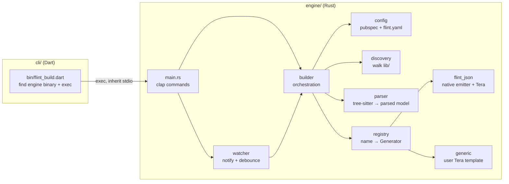

# Flint Build — Software Design Document

| | |
| --- | --- |
| **Status** | Living document. Update it in the same change as any design change. |
| **Scope** | The `engine/` Rust crate, the `cli/` Dart package, and the contract between them. |
| **Related** | [REVIEW.md](REVIEW.md) (current findings) · [ROADMAP.md](ROADMAP.md) (plan) · [configuration.md](configuration.md) (user-facing reference) · [specs/](specs/) (per-feature specs) |

Sections are marked **Current** (what the code does today) or **Target** (what we are building towards). When
you implement a Target item, move its text to Current and link the spec.

---

## 1. Purpose

Flint is a code generator for Dart/Flutter projects. It reads annotated Dart source, such as
`@JsonSerializable()` classes, and writes companion `.g.dart` part files, doing the same job as
`build_runner` + `json_serializable`. The heavy work runs in a native Rust binary. That avoids the Dart VM
startup and whole-program analysis that make `build_runner` slow.

## 2. Goals and non-goals

**Goals**

1. **Drop-in output:** for supported features, the generated code behaves like json_serializable's output. It
   compiles and produces the same JSON.
2. **Speed that grows with the project:** build time grows with the number of *changed* files, and all cores
   are used.
3. **Never damages user code:** Flint only writes and deletes files it can prove it owns (see §9).
4. **Extensible without Rust:** users can add a generator with a Tera template and a `flint.yaml` entry.
5. **Predictable:** the same inputs always produce byte-identical outputs, whatever the thread scheduling or
   plugin order.

**Non-goals (for now)**

- Replacing `build_runner` for generators that need full type resolution across packages, such as `freezed`
  unions or `riverpod_generator`. See §4 for why.
- Running Dart code at build time.
- Being a general Dart analyzer or language server.

## 3. Context

```text
Dart/Flutter project
 ├── pubspec.yaml         ← package name (read)
 ├── flint.yaml           ← plugin configuration (read, optional for json_serializable projects)
 ├── build.yaml           ← json_serializable options (read, optional; spec 0002)
 └── lib/**.dart          ← annotated sources (read)
        └── *.g.dart      ← generated parts (written/deleted by Flint)

dart run flint_build <cmd>   →   cli/bin/flint_build.dart   →   engine binary (flint_build)
```

## 4. The key constraint: parsing syntax only

Flint parses with **tree-sitter-dart**, which gives it a *syntax tree* and nothing more. It doesn't resolve
imports, types, or constants. That's where the speed comes from, and also where most of the limits come from:

| Knowable from one file's syntax | Not knowable without resolution |
| ------------------------------- | ------------------------------- |
| Class and enum names, fields, annotations, constructors, type text | Whether `Status` (imported) is an enum, a class, or a typedef |
| Literal annotation arguments (`name: 'id'`) | Values of `const` references (`name: kIdKey`) |
| Type parameters | Types from other packages, type aliases, extension types |

**How we deal with it** ([spec 0005](specs/0005-project-symbol-index.md), Current): we resolve **within the
project** without doing full type analysis:

1. **Index pass:** parse every file under `lib/` in parallel and record each file's top-level declarations
   (`name → {kind: class|enum|mixin|typedef|extension type, has_from_json, has_to_json}`, plus an enum's
   values), its `import`/`export` directives (prefixes, `show`/`hide`) and its parts. On 1,000 files this
   costs about as much as parsing alone (~72 ms, 4 cores), because the queries are compiled once.
2. **Resolve:** each field type is looked up the way Dart does: the file's library first, then its project
   imports and their transitive `export`s. Two visible declarations are an ambiguity error. The output then
   also depends on the files its types come from (§12).
3. **Generate:** `flint_json` converts by kind (enums get a per-library value map; classes need `fromJson`).
   A mixin, typedef, extension type, record or function type, or a name nothing declares, is an error with a
   fix (`@JsonKey(fromJson:, toJson:)` or a converter) instead of Dart that doesn't compile.
4. **Escape hatch:** other packages aren't indexed. A name Flint can't find, in a file that imports another
   package, is assumed to be a class (one warning per name); `external_types: [Money]` under the plugin
   confirms it.

**Target:** keep the index in a cache (§12) so a no-op build doesn't parse every file, and add constructors
to the declarations for R8.

This keeps Flint syntax-only, with no Dart SDK needed at build time, while fixing review items R7 and R8.

## 5. Architecture


```mermaid
flowchart LR
    subgraph CLI["cli/ (Dart)"]
        W[bin/flint_build.dart<br/>find engine binary + exec]
    end
    subgraph ENG["engine/ (Rust)"]
        M[main.rs<br/>clap commands] --> B[builder<br/>orchestration]
        B --> C[config<br/>pubspec + flint.yaml]
        B --> D[discovery<br/>walk lib/]
        B --> P[parser<br/>tree-sitter → parsed model]
        B --> R[registry<br/>name → Generator]
        R --> G1[flint_json<br/>native emitter + Tera]
        R --> G2[generic<br/>user Tera template]
        M --> WA[watcher<br/>notify + debounce]
        WA --> B
    end
    W -->|exec, inherit stdio| M
```

### 5.1 Components (Current)

| Module | Responsibility | Notes |
| ------ | -------------- | ----- |
| `cli/bin/flint_build.dart` | Finds `engine/target/{release,debug}/flint_build`; runs `cargo build --release` if it's missing; runs the engine with the same arguments. | Only works inside this monorepo (D1). |
| `main.rs` | clap CLI: `build`, `watch`, `clean`, with `--force` (aliases `-d`, `--delete-conflicting-outputs`). Registers built-in generators. | |
| `builder.rs` | `build(root, …) -> BuildReport`: discover once → per file in parallel: parse once, run matching plugins, apply the output rules (§9) → delete orphaned outputs. Per-file errors are collected. `clean(root)` deletes owned outputs only. | mtime-based skip (R11). |
| `output.rs` | Header, ownership marker, `assemble`, `is_owned`, `strip_legacy_preamble` (§9). | |
| `index.rs` | `SymbolIndex`: every file's declarations, parts and imports/exports; resolves a type name used in a file through the library, imports (prefixes, `show`/`hide`) and transitive exports, or reports an ambiguity (spec 0005). | Built from a parse of every file on every build. |
| `config/` | `Pubspec` (`name`, dependency lookup). `FlintConfig` / `PluginConfig` with a hand-written `Deserialize` that turns missing lists into empty ones, plus `flint_json` defaults. `build_yaml` reads json_serializable options. `resolve` merges `flint.yaml` > `build.yaml` > defaults and reports notes and warnings. | Pure `resolve` function; only `load_project_config` touches the disk. |
| `discovery/` | `walkdir` over `lib/`; splits sources and `*.g.dart` outputs by file name (`is_generated_file`). | Ownership is decided in `output.rs`, not here. |
| `parser/` | tree-sitter queries → `ParsedFile { classes, enums, part_directives }`. Reports syntax errors with a caret. | Keeps every class, not only annotated ones (A3). Annotation names are unprefixed text, so `@json.JsonSerializable()` isn't matched. |
| `registry.rs` | `HashMap<String, Box<dyn Generator>>`. | |
| `generators/flint_json` | Works out the `fromJson`/`toJson` expression for each field, then renders the built-in `flint_json.tera`. | |
| `generators/mod.rs` | `Generator` trait, `TemplateEngine`, and the shared annotation filter (`matches_plugin`, `retain_annotated`). | |
| `generators/generic.rs` | Filters by annotation, then renders the user's `template_path`. | |
| `watcher/` | `notify` with a 500 ms debounce loop on `lib/`, then a full build. Ignores access events and `.g.dart` paths. | |

### 5.2 The `Generator` trait

```rust
// Current: returns this plugin's *section*; the engine adds the header and `part of` (§9).
// Template problems come back as FlintError::Template (spec 0004). `types` resolves the type names used
// by the file's classes through the project symbol index (spec 0005).
pub trait Generator: Send + Sync {
    fn generate(&self, filename: &str, parsed_file: ParsedFile, plugin: &PluginConfig,
                types: &ResolvedTypes) -> Result<Generated, FlintError>;
}
// Generated { code: String, assumed_external: BTreeSet<String> }: the section, plus the type names it
// assumed come from another package, which the builder turns into one warning per name.
```

```rust
// Target
pub trait Generator: Send + Sync {
    /// Stable id, used in output headers and the cache fingerprint.
    fn id(&self) -> &str;
    /// Built once per build, before any file is processed (compiled templates, etc.).
    fn prepare(&mut self, plugin: &PluginConfig, index: &SymbolIndex) -> Result<(), FlintError>;
    /// Pure: same inputs → same output. `None` = nothing to emit for this file.
    fn generate(&self, unit: &SourceUnit, index: &SymbolIndex) -> Result<Option<Section>, Diagnostic>;
}
```

The Target version adds error reporting (R12), one-time setup (A1), and access to the symbol index (R7). It
returns a **section** rather than a whole file, so several plugins can share one `.g.dart` (R4, §9).

## 6. Data model

### 6.1 Current parsed model (`parser::dart_types`)

```text
ParsedFile { classes: [DartClass], enums: [DartEnum], part_directives, part_of?,
             directives: [{ kind: Import|Export, uri, prefix?, show, hide }],
             declarations: [{ name, kind: Class|Enum|Mixin|TypeAlias|ExtensionType, has_from_json, has_to_json }] }
// index::ResolvedType { kind, file?, has_from_json, has_to_json } per type name a file's generated classes use,
// plus (not in the template context) the declaring path, an enum's declaration, and possibly_external.
DartClass  { name, type_parameters: [String], metadata: {String: String}, fields: [DartField],
             getters: [{ name, line, dart_type, metadata }],
             constructors: [{ name?, is_factory, is_const, line,
                              params: [{ name, kind: Positional|OptionalPositional|Named, required, default?,
                                         initializes: This|Super|Plain, dart_type? }] }] }   // spec 0006
           // fields: one per variable (`final int a, b;`), statics left out
DartField  { name, line, dart_type: DartType, is_final, is_late, has_initializer, is_private,
             metadata: {String: String},
             converter?, from_json_expr?, to_json_expr? }   // last three are emitter scratch state
DartType   { kind: String|Int|Double|Bool|DateTime|Num|Dynamic|Object|Uri|BigInt|Duration
                   |List(T)|Set(T)|Iterable(T)|Map(K,V)|Custom(name)|Unsupported(text), is_nullable }
           // Custom keeps any import prefix ("m.Money"); records and function types are Unsupported
DartEnum   { name, annotations: [String], values: [{ name, value?, literal?, annotations: [{ name, value?, literal? }] }] }
           // value/literal are set per plugin from its variant_annotations (generators::select_variant_values);
           // literal is the argument's Dart source, so its type survives (R6)
```

`metadata` flattens every annotation on a node into one map. Annotation names become keys with a value of
`""`; named arguments become `key → raw source text`, quotes included. The same model is serialised into the
Tera context; see [configuration.md → Template context](configuration.md#template-context).

### 6.2 Target parsed model

```text
SourceUnit  { path, part_directives: [String], library_name?, classes, enums, spans }
Annotation  { name, prefix?, positional: [Literal|Expr], named: {String: Literal|Expr}, span }
Literal     = String(s) | Int(i) | Double(f) | Bool(b) | Null | Expr(raw)   // enum values already keep raw source (R6)
DartClass   { name, type_parameters, annotations: [Annotation], fields, constructors: [Constructor], span }
Constructor { name?, params: [Param{ name, kind: positional|named|this, required, default? }] }  // R8
DartField   { name, type: DartType, is_final, is_static, is_late, has_initializer, annotations, span }
DartType    { name, args: [DartType], nullable, resolved?: SymbolKind }   // filled in by the index
```

The render model (what templates see) is built *from* the parsed model by each generator and never written
back into it (A4). The render model is part of the **public, versioned template API** (`context_version: 1`).

## 7. Build pipeline

**Current** (specs 0001, 0005): load config (plugin order = file order) → walk `lib/` once, sorted → parse
**every** file in parallel and build the symbol index → for each file in parallel: resolve the field types of
its generated classes (ambiguity = error for the file) → skip if its output is owned and newer than the
source, the files its types come from, and the shared inputs → run each plugin whose annotations match → assemble the sections under one owned header → write only if the bytes changed, or
delete a stale owned output → collect outcomes in path order → delete owned outputs whose source is gone.
Steps 1, 2, 4, 5, 7, 8 and 9 of the target below exist in this simpler form (the index is rebuilt each
build rather than cached); fingerprints don't.

**Target:**

```text
1. Load config        pubspec.yaml, flint.yaml → validated, defaults applied, plugin order = file order
2. Discover           walk build roots (default lib/), apply include/exclude globs
3. Fingerprint        per source: content hash; global: engine version + config hash + template hashes
4. Index              parse changed + unindexed files in parallel → SymbolIndex (cached)
5. Plan               per source: which plugins match (by annotation) → expected output set
6. Generate           per (source, plugin) in parallel → Section | Diagnostic
7. Assemble           per source: concatenate sections in plugin order under one owned header
8. Write              only if the bytes changed; delete owned outputs that are no longer expected
9. Report             diagnostics grouped by file; non-zero exit on any error
```

## 8. Configuration

See [configuration.md](configuration.md) for the user reference.

**Current:** configuration comes from up to three files ([spec 0002](specs/0002-read-build-yaml.md)).
`flint.yaml` defines the plugins. Without it, `flint_json` is enabled implicitly when `build.yaml` configures
the json_serializable builder, or when `pubspec.yaml` depends on json_serializable. `build.yaml`'s
json_serializable options fill in `flint_json` settings that `flint.yaml` leaves unset. The emitter then
fills class metadata that the annotations leave unset, so the annotation always wins. Unsupported
`build.yaml` options produce warnings rather than being silently ignored.

Design rules:

- **Unknown keys are errors** (`#[serde(deny_unknown_fields)]`, Target), so typos don't silently do nothing.
- **Plugin order is the order in the file** (`IndexMap`), because output assembly depends on it.
- **Built-in plugin defaults** live next to the generator (Target: `Generator::defaults()`), not as special
  cases in `config/flint.rs`.

## 9. Output contract (Current since [spec 0001](specs/0001-generated-output-ownership.md))

1. Every file Flint writes starts with the header `// GENERATED CODE - DO NOT MODIFY BY HAND` followed by
   `// flint_build <engine version>`. **Ownership = that marker line is present** (or, for files from
   earlier versions, the `(Powered by Flint)` banner). *Target:* add the fingerprint from §12 to the line.
2. Flint writes `<stem>.g.dart` only if the source contains `part '<stem>.g.dart';` and at least one plugin
   produced a section for it.
3. `clean` and stale-output removal only delete files that carry the Flint ownership header.
4. When several plugins match the same source, their sections are concatenated in config order into a single
   `.g.dart`, like source_gen's `SharedPartBuilder`. *Target:* a plugin may declare its own
   `output_extension` instead.
5. Output is byte-identical for identical inputs, and an unchanged file is never rewritten.
6. An existing `.g.dart` without the marker is never overwritten unless `--force` is given.

## 10. Error handling

- **Current:** `anyhow` in the builder and config; typed `FlintError::Syntax` and `FlintError::Template`
  ([spec 0004](specs/0004-template-errors.md)). No `unwrap`/`expect` in non-test code. A template that can't be
  loaded is reported once per plugin, and files that plugin matches are left untouched. `FlintError::UnsupportedType`
  names the line, field, problem and fix for a type `flint_json` can't convert (spec 0005). Per-file errors are collected into `BuildReport.errors` (as strings) and the build exits non-zero if any
  occurred; one bad file no longer hides the others.
- **Target:** library code returns `Result<_, FlintError>` (`thiserror`), and `anyhow` is only used in
  `main.rs`. Per-file `Diagnostic { severity, file, span, message, hint }` values are collected, not
  short-circuited, so one bad file doesn't hide the others. The exit code is non-zero if any error occurred.
  There is no `unwrap`/`expect` outside tests and provably-infallible spots (with a comment).

## 11. Concurrency

`rayon`'s global pool handles per-file work. Parsers are created per task (tree-sitter `Parser` isn't `Sync`).
The tree-sitter `Query` objects are compiled once per process (`LazyLock` statics) and shared by every thread,
because compiling one costs ~3 ms against ~86 µs to parse a file (spec 0005, step 1). **Target:** compile
Tera templates once as well (`prepare`), which is most of the remaining `--force` time (A1). Output assembly and writing stay deterministic because the final output order
depends on sorted paths and config order, never on which thread finishes first.

## 12. Incremental builds and watch mode

- **Current:** skip a file when its output is owned and newer than the source, the files its resolved types
  are declared in (spec 0005), and the newest shared input (`flint.yaml`, `build.yaml`, `pubspec.yaml`,
  templates, the engine binary). Types are resolved before this check on every build. Unchanged output only gets
  its mtime refreshed. Watch mode runs a full build once per burst of changes, ignoring access events and
  `.g.dart` paths; only relevant events extend the debounce.
- **Target:** keep a cache in `.dart_tool/flint/cache.json` with `{engine_version, config_hash,
  template_hashes, files: {path: {content_hash, outputs, declared_symbols}}}`.
  - A file is dirty when its content hash changes, or when the global fingerprint changes (which makes
    everything dirty).
  - If a changed file changes its declared symbols, the files that reference those symbols are dirty too.
    This is how a cross-file enum change still triggers regeneration.
  - Watch mode ignores events for paths Flint owns and only rebuilds the dirty set (R5).
  - `build --check` exits non-zero if anything is dirty, for CI.

## 13. Distribution (Target; fixes D1 and D2)

1. CI builds release binaries for `x86_64/aarch64 × linux/macos` and `x86_64 windows`, and attaches them to a
   GitHub Release with SHA-256 checksums.
2. The Dart CLI works out the platform triple, then looks for a binary in this order:
   1. `FLINT_ENGINE_PATH` (explicit override).
   2. `.dart_tool/flint/bin/<version>/flint_build` (cache).
   3. A download from the release matching the **CLI package version**, with the checksum verified, into the
      cache.
   4. `cargo build --release` from the monorepo, when running from a checkout (dev mode).
3. The CLI and engine versions are kept in step. The CLI runs `flint_build --version` and refuses a mismatch
   unless `FLINT_ENGINE_PATH` is set.
4. The engine is published to crates.io, which makes `cargo install flint_build` work too.

## 14. Testing strategy

| Layer | Tool | Proves |
| ----- | ---- | ------ |
| Unit (per module) | `cargo test` | Parsing, type mapping, naming strategies, config defaults |
| Snapshot | `insta` | The generated text is stable; any change shows up as a reviewable diff |
| **Dart golden** (H7) | `engine/tests/dart_golden/check.sh`: `dart analyze --fatal-infos` on generated fixtures, then `dart test` round-trips against expected JSON | The output **compiles** and produces the expected JSON |
| **Differential** (Target; the golden round-trips cover part of it by hand) | Round-trip the same fixtures through json_serializable and Flint, compare JSON | The output **behaves the same** |
| End-to-end | Scratch project + CLI | `build`/`watch`/`clean` behaviour, file ownership |
| Benchmarks | `hyperfine` on synthetic projects (10/100/1000 files) | Performance claims (see D3) |

Rule: every bug fix in the emitter comes with a fixture that failed before the fix: an insta fixture for the
text, and a model plus round-trip expectations in the Dart golden package for behaviour. CI runs all layers
except benchmarks on every push (`.github/workflows/ci.yml`).

## 15. Design decisions

| # | Decision | Why | Revisit if |
| - | -------- | --- | ---------- |
| DD1 | tree-sitter (syntax only) instead of the Dart analyzer | Speed; no Dart SDK needed at build time | Cross-package resolution becomes a must-have |
| DD2 | The Rust binary does the work; Dart only launches it | `dart run` stays the entry point users know | Dart VM startup dominates (D3), in which case recommend running the binary directly |
| DD3 | Tera templates for generators | No Rust needed to extend; Jinja-like syntax is familiar | We need logic Tera can't express; then consider WASM plugins |
| DD4 | Native emitter logic + template for `flint_json` | Type-directed expressions are much easier in Rust | — |
| DD5 | One shared `.g.dart` per source | Matches how json_serializable users already write `part` directives | A plugin needs its own file (then use `output_extension`) |
| DD6 | Read json_serializable's `build.yaml` options instead of requiring a `flint.yaml` | Migrating then needs no new file and keeps the JSON wire format identical | Flint's options diverge from json_serializable's |
| DD7 | `field_rename` is parsed into a `FieldRename` enum at load time; `camel` = lowerCamelCase | A typo can't silently change the wire format; names match serde and common usage | — |
| DD8 | Ownership is a marker line in the file, not a manifest | Survives `git checkout`, copying and deleted caches; checking it only reads the first 1 KiB | Files need to be recognised without being opened |

## 16. Open questions

1. ~~Should Flint read `build.yaml` `json_serializable` options so migrating needs no `flint.yaml`?~~
   **Resolved: yes.** See [spec 0002](specs/0002-read-build-yaml.md) and DD6.
2. ~~Should `field_rename: camel` mean PascalCase or be removed?~~ **Resolved:** it means lowerCamelCase,
   and unknown values are errors. See [spec 0003](specs/0003-field-rename-camel.md) and DD7.
3. Should the parsed model be exposed as JSON (`flint_build dump-ir`) so people can write generators in any
   language?
4. Is sharing one `.g.dart` (DD5) compatible with projects that run build_runner alongside Flint during a
   migration?
